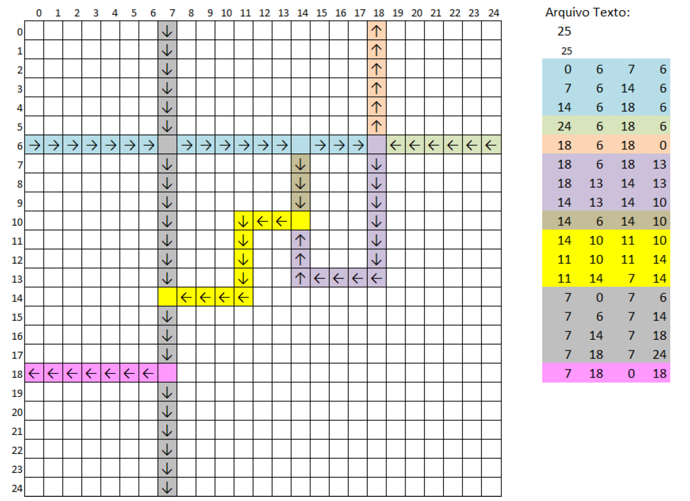

# Simulador de tráfego

### Objetivo do Trabalho  
Desenvolver um simulador de tráfego. Neste simulador há veículos que se movem pelas vias de uma malha viária. A malha é informada através de arquivo.   

### Especificação dos Veículos
* Cada veículo deve ser um thread.
* O veículo se movimenta pela malha, uma posição por vez, respeitando o sentido de fluxo da via. O veículo só pode se mover caso a posição à frente esteja livre.
* Ao se deparar com um cruzamento:
	* Deve escolher, aleatoriamente, uma das vias de saída do cruzamento para seguir.
* Só deve passar pelo cruzamento se estiver totalmente livre (exclusão mútua).
* Não deve bloquear o cruzamento de outros veículos (ficar parado no cruzamento).
* Novos veículos são inseridos nos pontos de entrada da malha (ver especificação da malha)
* Ao atingir um ponto de saída (ver especificação da malha), o veículo deve ser encerrado.

### Especificação da Malha Viária
* Deve ser carregada de um arquivo texto.
* Nas duas primeiras estão a quantidade de linhas (x) e colunas (y) da malha, respectivamente.
* As próximas linhas especificam os segmentos de vias, no formato: xInicial yInicial xFinal yFinal
* Características das vias:
	* São sempre horizontais ou verticais (não haverá vias em diagonal).
    * São de mão única.
    * Nas bordas, só haverá vias perpendiculares.
    * Entre vias paralelas, haverá sempre ao menos uma linha ou coluna em branco (ou seja, não haverá vias “grudadas” umas nas outras).
* Identificação de pontos de entrada e de saída de veículos:
    * Entrada: a primeira posição das vias em que o xInicial e yInicial são uma borda.
    * Saída: a última posição das vias em que o xFinal e yFinal são uma borda.  
* Exemplo de malha e arquivo:   
   
 
 
### Especificação Geral do Sistema
* A malha e os veículos devem ser visualizados em uma interface gráfica (ex: um JTable)
* Deve possuir opções para:
	* limitar quantidade de veículos: o usuário informar a quantidade máxima de veículos
		* [opcional] intervalo de inserção de veículos (de quanto em quanto tempo).
    * iniciar simulação: fica inserindo veículos, que se movimentam na malha.
    * encerrar simulação: para de inserir e encerra imediatamente todos os veículos.
		* [opcional] encerrar e aguardar veículos saírem da malha.
* Deve suportar tanto semáforos quanto monitores. Deve haver uma opção para o usuário escolher qual destes mecanismos será utilizado. 
 